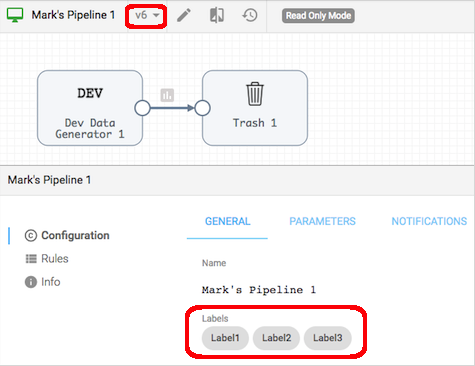
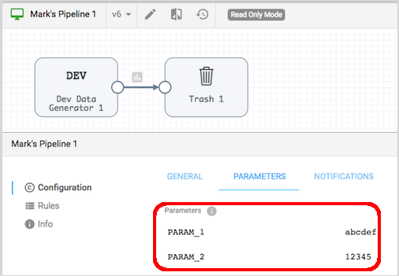
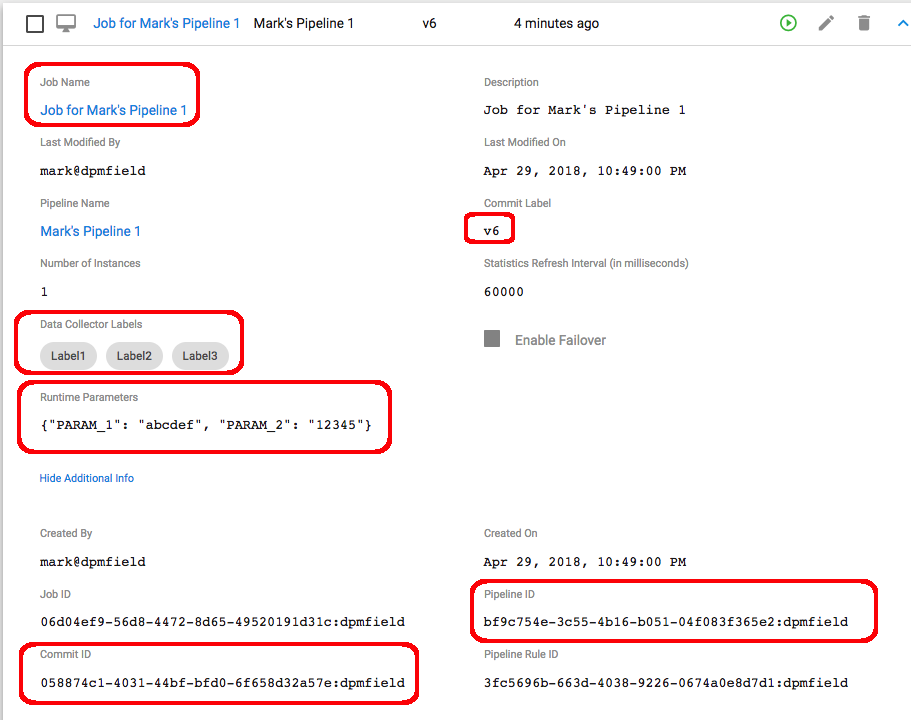

# Generating a Job for the latest version of a Pipeline

This example retrieves the latest commit (i.e. version) of a given pipeline, including its labels 
and runtime parameter values, and creates a Job with the same labels and runtime parameter 
values.  As you may or may not want to automatically propagate all labels and runtime parameters;
this example is intended only as a starting point to demonstrate the API.

## Prerequisites

* An account on StreamSets Control Hub with read and write permissions on Jobs and Pipelines
* A Python 3 environment

## Step 1: Start with a Pipeline Version like this:

 

Note the pipeline is on Version 6 and has three labels.  

On the Parameters tab you can see two parameters are set:

 

On the Info tab you can see the Pipeline ID:

 

## Step 2: Provide Control Hub credentials 

Set your Control Hub credentials in the file ```private/sch_credentials.json```
  
## Step 3: Prepare the script
 
Set the Control Hub URL and Pipeline ID in the script ```bin/create_job_for_pipeline.sh```.
That script is a wrapper around the python script located at ```python/create_job_for_pipeline.py```
 
  
## Step 4: Run the script
 
To run the script, cd to the bin directory and execute the command ```./create_job_for_pipeline.sh```:

Here is an example session:
 
```
$ cd bin
$ ./create_job_for_pipeline.sh

{"message":"Authentication succeeded"}

Connecting to Control Hub at https://trailer.streamsetscloud.com

Getting latest commit for pipeline ID: bf9c754e-3c55-4b16-b051-04f083f365e2:dpmfield

** Latest Commit *************************
Pipeline ID : bf9c754e-3c55-4b16-b051-04f083f365e2:dpmfield
Pipeline Name : Mark's Pipeline 1
Description : New Pipeline
Version : 6
Commit ID : 058874c1-4031-44bf-bfd0-6f658d32a57e:dpmfield
Rules ID : 3fc5696b-663d-4038-9226-0674a0e8d7d1:dpmfield
Pipeline Labels : ["Label1", "Label2", "Label3"]

Getting runtime parameters for commit ID: 058874c1-4031-44bf-bfd0-6f658d32a57e:dpmfield

** Runtime Parameters ********************
PARAM_1 : abcdef
PARAM_2 : 12345

Creating Job

** Job Configuration *******************
name : Job for Mark's Pipeline 1
description : New Pipeline
pipelineName : Mark's Pipeline 1
pipelineId : bf9c754e-3c55-4b16-b051-04f083f365e2:dpmfield
pipelineCommitId : 058874c1-4031-44bf-bfd0-6f658d32a57e:dpmfield
rulesId : 3fc5696b-663d-4038-9226-0674a0e8d7d1:dpmfield
pipelineCommitLabel : v6
labels : ["Label1", "Label2", "Label3"]
statsRefreshInterval : 60000
numInstances : 1
migrateOffsets : False
edge : False
runtimeParameters : "{\"PARAM_1\": \"abcdef\", \"PARAM_2\": \"12345\"}"

Job created successfully!
Job ID: 06d04ef9-56d8-4472-8d65-49520191d31c:dpmfield

Done 
```
 
And here we can see the new Job created in Control Hub for v6 of the pipeline, with the 
same labels and runtime parameter values:
 
 
 
