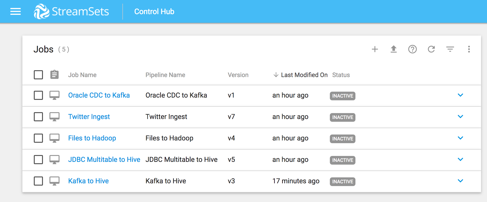
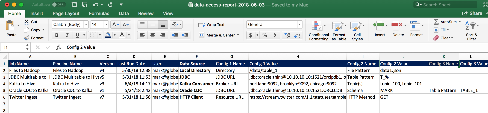

# StreamSets Control Hub Data Access Report

Generates a report of data sources used by [StreamSets Control Hub](https://streamsets.com/products/sch) Jobs using the StreamSets Control Hub API

## Overview
This is a simple example that shows how the Control Hub API can be used to generate reports that include Pipeline details (for example, details of the data sources accessed) as a complement to Control Hub's built-in [Data Delivery Reports](https://streamsets.com/documentation/controlhub/latest/help/index.html#controlhub/UserGuide/Reports/DeliveryReports_title.html#concept_xkf_v34_ndb)

One can include up to three properties per data source in the report (three is just an arbitrary limit in this example).  For example,  if the Data Source is a Kafka Consumer, the report could include the Kafka Broker URIs and the list of topics.

This is a "quick and dirty" first version of the report and features could be added as needed.

The report is currently hard-coded to generate a pipe delimited text file as well as to write to the console.

Parameterized config values are replaced with the parameter values associated with the Job.  For example, if a Kafka Consumer is configured to consume from ${TOPIC},  the report will replace ${TOPIC} with the value of the TOPIC parameter set in the Job  

Pipeline fragments are not yet supported. 

## Prerequisites

* An account on StreamSets Control Hub with read permissions on Jobs and Pipelines to be reported on
* A Python 3 environment

## Configuration
* Set the Control Hub URL, Start and End Dates for the report and the name of an output file to be created in the file ```bin/data_access_report.sh```.  Dates should be provided in ```yyyy-mm-dd``` format. 

* Set your Control Hub credentials in the file ```private/sch_credentials.json```

* Edit the file ```python/data_source_config.py``` to provide labels for data sources and properties to report on per data source.  For example, to report on Jobs that use the HTTP Client datasource, one could specify properties and labels like this: 

``` 
## HTTP Client 
data_sources['com_streamsets_pipeline_stage_origin_http_HttpClientDSource'] = {
  'label':'HTTP Client',
  'properties':{
    'conf.resourceUrl':'Resource URL',
    'conf.httpMethod':'HTTP Method'
  }
}
```

A starter set of data source configs are provided in the project's ```python/data_source_config.py``` source file

## Running the Project
To run the project:

* Switch to the project's bin directory and run the script ```./data_access_report.sh```

Here is a view of five Jobs in Control Hub:




Here is the command line output from running a report that includes those five jobs:

```
$ ./data_access_report.sh
{"message":"Authentication succeeded"}

================================================
Data Access Report from 2018-01-01 to 2018-12-31
================================================

=======================================
Job Name: Files to Hadoop
Pipeline Name: Files to Hadoop
Pipeline Version: v4
Last Run Date: 2018-05-30 12:38:36
User: mark@globex
Data Source: Local Directory
Config 1 Name: Directory
Config 1 Value: /data/table_1
Config 2 Name: File Pattern
Config 2 Value: data1.json
=======================================
Job Name: JDBC Multitable to Hive
Pipeline Name: JDBC Multitable to Hive
Pipeline Version: v5
Last Run Date: 2018-05-31 11:53:55
User: mark@globex
Data Source: JDBC
Config 1 Name: JDBC URL
Config 1 Value: jdbc:oracle:thin:@10.10.10.10:1521/orclpdb1.localdomain
Config 2 Name: Table Pattern
Config 2 Value: T_%
=======================================
Job Name: Kafka to Hive
Pipeline Name: Kafka to Hive
Pipeline Version: v3
Last Run Date: 2018-06-04 14:17:17
User: mark@globex
Data Source: Kafka Consumer
Config 1 Name: Broker URI
Config 1 Value: portland:9092, brooklyn:9092, chicago:9092
Config 2 Name: Topic(s)
Config 2 Value: topic_100, topic_101
=======================================
Job Name: Oracle CDC to Kafka
Pipeline Name: Oracle CDC to Kafka
Pipeline Version: v1
Last Run Date: 2018-05-24 02:42:39
User: mark@globex
Data Source: Oracle CDC
Config 1 Name: JDBC URL
Config 1 Value: jdbc:oracle:thin:@10.10.10.10:1521:ORCLCDB
Config 2 Name: Schema
Config 2 Value: MARK
Config 3 Name: Table Pattern
Config 3 Value: TABLE_1
=======================================
Job Name: Twitter Ingest
Pipeline Name: Twitter Ingest
Pipeline Version: v7
Last Run Date: 2018-05-31 11:58:54
User: mark@globex
Data Source: HTTP Client
Config 1 Name: Resource URL
Config 1 Value: https://stream.twitter.com/1.1/statuses/sample.json
Config 2 Name: HTTP Method
Config 2 Value: GET
=======================================

Created Data Access Report in the file /Users/mark/data-access-report-2018-06-03.txt

Done
```

In Excel, the report looks like this:




