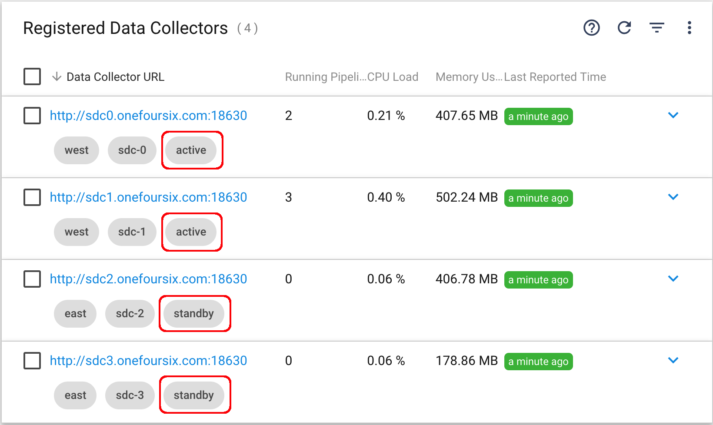
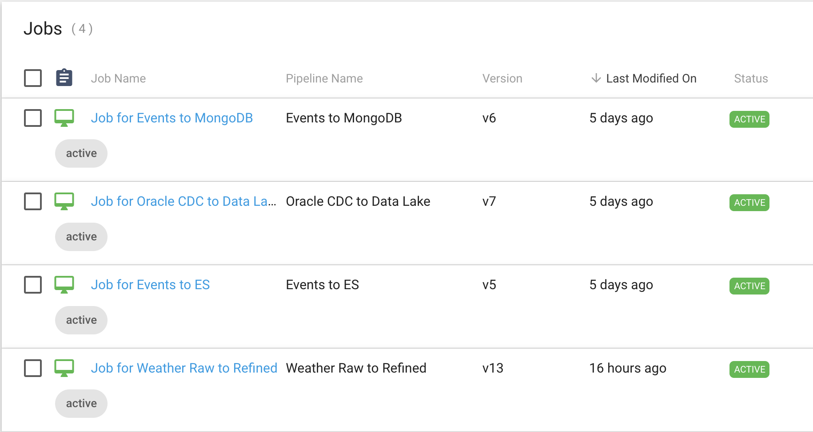
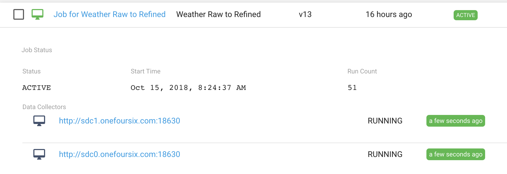
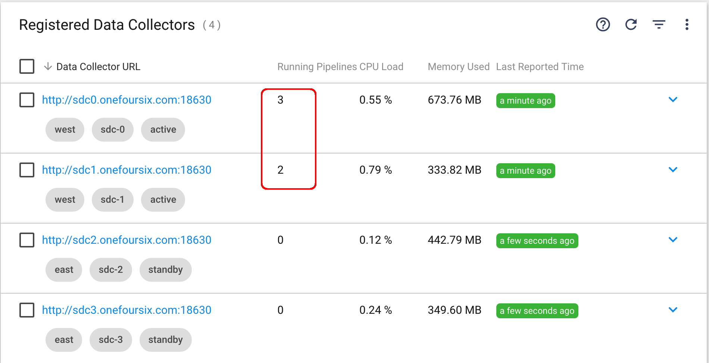
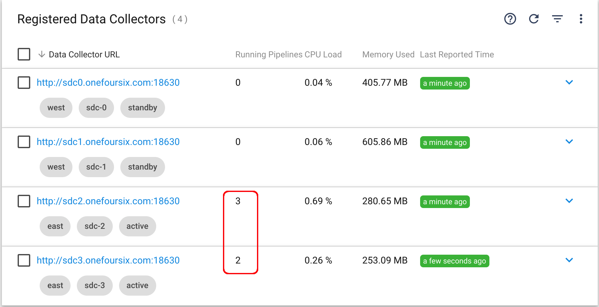

# Migrating Jobs across sets of Data Collectors

This example shows one way (out of many) to use the [StreamSets Control Hub](https://streamsets.com/products/sch) REST API to migrate active Jobs across sets of [Data Collectors](https://streamsets.com/products/sdc).

This might be useful if, for example, you have Jobs running on a set of Data Collectors in Data Center 1 and you wish to migrate them to a set of Data Collectors in Data Center 2. Another use would be to migrate Jobs from a set of standalone Data Collectors to a set of [Data Collectors running under Kubernetes](https://streamsets.com/documentation/controlhub/latest/help/controlhub/UserGuide/DataCollectorsProvisioned/Provisioned.html#concept_jsd_v24_lbb).

The approach shown in this example does not change any aspect of the Jobs themselves; it works by swapping Data Collector [Labels](https://streamsets.com/documentation/controlhub/latest/help/controlhub/UserGuide/Labels/Labels_Assign.html#concept_xzy_4gs_rw) and then [Synchronizing](https://streamsets.com/documentation/controlhub/latest/help/controlhub/UserGuide/Jobs/Jobs-Managing.html#concept_vt5_qwn_hy) the Jobs.


## Example Data Collector Configuration
Assume we have four Data Collectors split across two regions (East and West) with labels assigned in each Data Collector's Control Hub configuration file (as described [here](https://streamsets.com/documentation/controlhub/latest/help/controlhub/UserGuide/Labels/Labels_Assign.html?hl=labels)) that identifies each Data Collector's region and name. 

To support the automatic migration of Jobs across regions we'll use two additional labels (```active``` and ```standby```) assigned to the Data Collectors within Control Hub. We'll assign the label ```active``` to Data Collectors in the West and ```standby``` to Data Collectors in the East:



With those labels in place, Jobs that reference the label ```active``` will initially run on Data Collectors in the West.  If we swap Data Collector labels so that Data Collectors in the West are labeled as ```standby``` and Data Collectors in the East are labeled as ```active``` and then invoke a [Synchronize](https://streamsets.com/documentation/controlhub/latest/help/controlhub/UserGuide/Jobs/Jobs-Managing.html#concept_vt5_qwn_hy) command, the Jobs will migrate to Data Collectors in the East.

## Example Jobs
Assume we have four Jobs running with the ```active``` label:



Note that one of the Jobs is configured to run with two instances, which causes it to run pipelines concurrently on two different Data Collectors for horizontal scale-out:



This results in five Pipeline instances running on Data Collectors in the West for the four Jobs:



## Enable Failover for Jobs to be Migrated

Make sure '[Enable Failover](https://streamsets.com/documentation/controlhub/latest/help/controlhub/UserGuide/Jobs/PipelineFailover.html#concept_oht_krp_qz)' is set for all Jobs to be migrated so Control Hub can manage offsets for pipelines moved across Data Collectors.

## Migrating Jobs
This project's example script will migrate Jobs labeled as ```active``` from Data Collectors in the West to the East.  We'll start by running the script in 'Dry Run' mode to confirm all is correct before running the script for real.

## Running the script in 'Dry Run' mode

To run the script in 'Dry Run' mode, set your Control Hub credentials in the file ```private/sch_credentials.json``` and edit the ```SCH_URL```, ```ACTIVE_LABEL``` and ```STANDBY_LABEL``` properties in the file ```bin/migrate-jobs.sh```.  For example, in my environment, I'll use my own Control Hub URL and the labels ```active``` and ```standby```:

```
## Control Hub URL
SCH_URL=http://warsaw.onefoursix.com:18631

## Data Collector Labels to swap
ACTIVE_LABEL=active
STANDBY_LABEL=standby
```

The shell script ```bin/migrate-jobs.sh``` defaults to running in ```DRY_RUN``` mode. 

Once those properties are set, change to the ```bin``` directory and run the script:


```
$ ./migrate-jobs.sh 
{"message":"Authentication succeeded"}

----------------------------------------------------------------------------------------
Dry Run (No changes will be made)
----------------------------------------------------------------------------------------

Connecting to Control Hub at http://warsaw.onefoursix.com:18631

Using the labels 'active' and 'standby'

Current Data Collectors and labels before making any changes:

----------------------------------------------------------------------------------------
SDCs with the label 'active'            Fixed Labels                  Control Hub Labels                                
----------------------------------------------------------------------------------------
http://sdc1.onefoursix.com:18630        west,sdc-1                    active                                            
http://sdc0.onefoursix.com:18630        west,sdc-0                    active                                            

----------------------------------------------------------------------------------------
SDCs with the label 'standby'           Fixed Labels                  Control Hub Labels                                
----------------------------------------------------------------------------------------
http://sdc3.onefoursix.com:18630        east,sdc-3                    standby                                           
http://sdc2.onefoursix.com:18630        east,sdc-2                    standby                                           


Jobs to be migrated (Active Jobs with the label 'active'):
----------------------------------------------------------------------------------------
Job Name                                Pipeline Name                 SDC URL(s)                                        
----------------------------------------------------------------------------------------
Job for Events to ES                    Events to ES                  http://sdc1.onefoursix.com:18630                  

Job for Events to MongoDB               Events to MongoDB             http://sdc1.onefoursix.com:18630                  

Job for Oracle CDC to Data Lake         Oracle CDC to Data Lake       http://sdc0.onefoursix.com:18630                  

Job for Weather Raw to Refined          Weather Raw to Refined        http://sdc1.onefoursix.com:18630                  
                                                                      http://sdc0.onefoursix.com:18630                  

----------------------------------------------------------------------------------------
End of Dry Run
----------------------------------------------------------------------------------------


Done

```

The script reports on Data Collectors with matching labels and finds the four active ```prod``` Jobs with five active Pipelines (including both instances of the 'Weather Raw to Refined' pipeline, running on two different Data Collectors).


## Running the script 

If everything looks good in the Dry Run, one can run the script for real by setting ```MODE=DO_IT``` in ```bin/migrate-jobs.sh```

Here is example output from a full run of the script:

```
$ ./migrate-jobs.sh 
{"message":"Authentication succeeded"}

Connecting to Control Hub at http://warsaw.onefoursix.com:18631

Using the labels 'active' and 'standby'

Current Data Collectors and labels before making any changes:

----------------------------------------------------------------------------------------
SDCs with the label 'active'            Fixed Labels                  Control Hub Labels                                
----------------------------------------------------------------------------------------
http://sdc1.onefoursix.com:18630        west,sdc-1                    active                                            
http://sdc0.onefoursix.com:18630        west,sdc-0                    active                                            

----------------------------------------------------------------------------------------
SDCs with the label 'standby'           Fixed Labels                  Control Hub Labels                                
----------------------------------------------------------------------------------------
http://sdc2.onefoursix.com:18630        east,sdc-2                    standby                                           
http://sdc3.onefoursix.com:18630        east,sdc-3                    standby                                           


Jobs to be migrated (Active Jobs with the label 'active'):
----------------------------------------------------------------------------------------
Job Name                                Pipeline Name                 SDC URL(s)                                        
----------------------------------------------------------------------------------------
Job for Events to ES                    Events to ES                  http://sdc1.onefoursix.com:18630                  

Job for Events to MongoDB               Events to MongoDB             http://sdc1.onefoursix.com:18630                  

Job for Oracle CDC to Data Lake         Oracle CDC to Data Lake       http://sdc0.onefoursix.com:18630                  

Job for Weather Raw to Refined          Weather Raw to Refined        http://sdc1.onefoursix.com:18630                  
                                                                      http://sdc0.onefoursix.com:18630                  

----------------------------------------------------------------------------------------
Swapping Data Collector Labels:
----------------------------------------------------------------------------------------
Replacing Data Collector Label 'active' with 'standby' for SDC at http://sdc1.onefoursix.com:18630
Replacing Data Collector Label 'active' with 'standby' for SDC at http://sdc0.onefoursix.com:18630
Replacing Data Collector Label 'standby' with 'active' for SDC at http://sdc2.onefoursix.com:18630
Replacing Data Collector Label 'standby' with 'active' for SDC at http://sdc3.onefoursix.com:18630
----------------------------------------------------------------------------------------
Synchronizing Jobs:
----------------------------------------------------------------------------------------
Synchronizing Job: Job for Events to ES
Synchronizing Job: Job for Events to MongoDB
Synchronizing Job: Job for Oracle CDC to Data Lake
Synchronizing Job: Job for Weather Raw to Refined
----------------------------------------------------------------------------------------
Synchronizing Jobs Complete
----------------------------------------------------------------------------------------


Active Jobs with the label 'active' after migration:
----------------------------------------------------------------------------------------
Job Name                                Pipeline Name                 SDC URL(s)                                        
----------------------------------------------------------------------------------------
Job for Events to ES                    Events to ES                  http://sdc3.onefoursix.com:18630                  

Job for Events to MongoDB               Events to MongoDB             http://sdc2.onefoursix.com:18630                  

Job for Oracle CDC to Data Lake         Oracle CDC to Data Lake       http://sdc2.onefoursix.com:18630                  

Job for Weather Raw to Refined          Weather Raw to Refined        http://sdc2.onefoursix.com:18630                  
                                                                      http://sdc3.onefoursix.com:18630                  


Done

```

Note that after the script completes, the five pipelines are running on the East Data Collectors:




## Implementation Notes
All interaction with the Control Hub REST API is encapsulated in the script ```python/utils/control-hub-api-helper.py```.

The API calls to update labels and synchronize Jobs could be performed in only a few lines of code; the majority of the code in this example validates that SDCs and Jobs are in a suitable state for Job migration.  

SDC validation rules include:

- There is at least one SDC for both labels
- No Edge Data Collectors have one of the labels
- No SDC has one of the labels as a "fixed" (immutable) label
- No SDC has both labels 

Job validation rules include:

- Jobs are not out of sync


For details, see the validation checks in ```python/utils/sdc_validator.py``` and ```python/utils/job_validator.py```.


