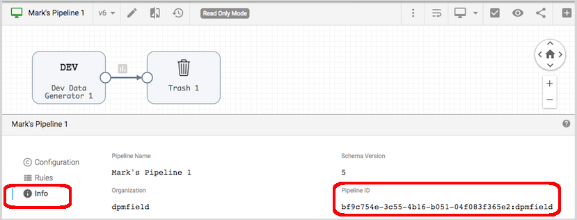

# Generating a Job for the latest version of a Pipeline

This example retrieves the latest commit (i.e. version) of a given pipeline, including its labels 
and runtime parameter values, and creates a Job with the same labels and runtime parameter 
values.  As you may or may not want to automatically propagate all labels and runtime parameters;
this example is intended only as a starting point to demonstrate the API.

## Prerequisites

* An account on StreamSets Control Hub with read and write permissions on Jobs and Pipelines
* A Python 3 environment

## Step 1: Start with a Pipeline Version like this:

 

Note the pipeline is on Version 6 and has three labels.  

On the Parameters tab you can see two parameters are set:

 

On the Info tab you can see the Pipeline ID:

 

## Step 2: Provide Control Hub credentials 

Set your Control Hub credentials in the file ```private/sch_credentials.json```
  
## Step 3: Prepare the script
 
Set the Control Hub URL and Pipeline ID in the script ```bin/create_job_for_pipeline.sh```.
That script is a wrapper around the python script located at ```python/create_job_for_pipeline.py```
 
  
## Step 4: Run the script
 
To run the script, cd to the bin directory and execute the command ```./test_pipeline_best_practices.sh```:

Here is an example session:
 
```
$ cd bin
$ ./create_job_for_pipeline.sh

{"message":"Authentication succeeded"}

Connecting to Control Hub at https://trailer.streamsetscloud.com

Getting latest commit for pipeline ID: bf9c754e-3c55-4b16-b051-04f083f365e2:dpmfield

** Runtime Parameters ********************
REPLICA_ORIGIN_TABLE : COURSEOFFERING
REPLICA_SNOWFLAKE_ACCOUNT : k12
REPLICA_SNOWFLAKE_USER : PIPELINE_USER_DEV
REPLICA_SNOWFLAKE_PASSWORD : XXXX
REPLICA_SNOWFLAKE_WAREHOUSE : LOAD_WH
REPLICA_ORIGIN_SCHEMA : REPLICA_DEV10_SAMS
REPLICA_ORIGIN_DATABASE : DATAVAULT_DEV
REPLICA_ORIGIN_TABLE_COLUMNS : ID,SCHOOLYEAR,MODIFYDATE,IS_DELETED,VLT_CREATE_DATETIME
STG_SNOWFLAKE_ACCOUNT : k12
STG_SNOWFLAKE_USER : PIPELINE_USER_DEV
STG_SNOWFLAKE_PASSWORD : XXXX
STG_SNOWFLAKE_WAREHOUSE : LOAD_WH
STG_DEST_TABLE : STG_CLASSROOM_OFFERING_ACADEMIC_YEAR_SAMS
STG_DEST_DATABASE : DATAVAULT_DEV
STG_DEST_SCHEMA : STAGE_DEV_10_SAMS

Testing Job
Detected non-descriptive label: Replica Origin Read Mode As Query - Fragment 1
Detected non-descriptive label: Field Renamer
Detected non-descriptive label: Type Converter
Detected non-descriptive label: Staging Destination Fragment 1
Done 
```
 
And here we can see the new Job created in Control Hub for v6 of the pipeline, with the 
same labels and runtime parameter values:
 
 
 
